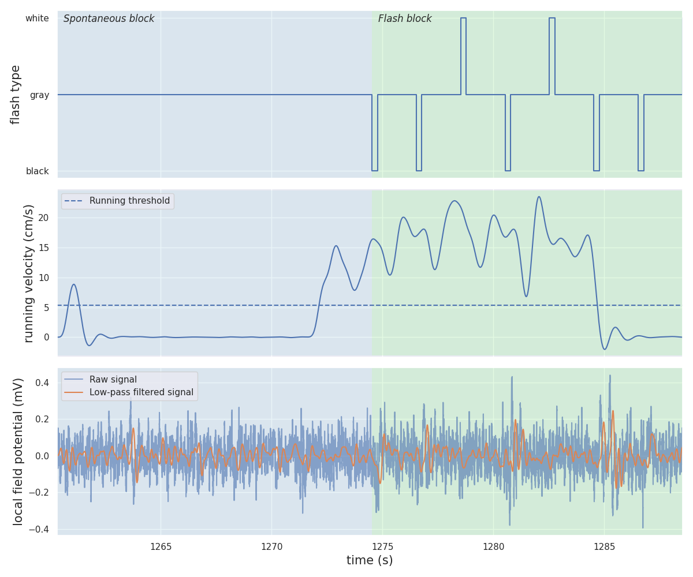

# Mining and spectral analysis of local field potential (LFP) data from Allen Visual Coding Neuropixels dataset

The main goal of this repository is to construct a pipeline for selective downloading, exploring and analysing of LFP data. Previous work has revealed the ~6Hz (theta) oscillation, especially prominent in secondary visual cortex (V2M). Here, this was investigated further by considering a large number of experimental sessions recorded by the Allen Institute. Data processing included filtering probe channels, classifying animal's running speed time series into running and non-running segments, alignment of LFPs to stimuli presentations. Analyses included testing normality of data, calculating weighted averages across sessions and spectral analysis across different segments.

## Data preparation

### AllenSDK

Description of experiments, stimuli, recording, quality metrics and API access are here: https://allensdk.readthedocs.io/en/latest/visual_coding_neuropixels.html. Technical whitepaper is linked on this webpage, where more in-depth information can be found.

_EcephysProjectCache_ is the key AllenSDK construct which enables working with the databases. It contains cache information about all experimental sessions, probes, channels and units. All data, metadata and manifest information downloaded through it are stored in cache directory specified at initialisation. LFP data can be loaded in form of [Xarrays](https://docs.xarray.dev/en/stable/index.html).

### Areas of interest

Each session contains data from 6 recording probes centered around visual cortex. For comparison with previous work, primary visual cortex (VISp in Allen terminology) and secondary visual cortex (composed of VISpm and other areas) were of interest. Only 32 sessions, which included one probe passing through VISp and another probe passing through VISpm, were selected.

### Dandi archive

Data was downloaded from the [Dandi archive](https://dandiarchive.org/dandiset/000021/) using dandi_manifest.json file (edited [asset list](https://api.dandiarchive.org/api/dandisets/000021/versions/draft/assets/)). Alternatively, data can automatically be downloaded from AllenSDK, but this often led to downloading errors when the connection was unstable.

### Flash stimuli

The visual stimuli of interest were flashes of the screen shown to the animals. Unlike previous work, where the flashes were constantly alternating (from black to white), Allen flash stimuli are not consistently alternating, but probably drawn somewhat randomly. Another difference is that "baseline" screen is gray and the flash can be either black or white. The duration of the flash is 250ms and the time between two consecutive flashes is 2s.

Visual coding experiments consist of two stimulus sets termed "Brain Observatory 1.1" and "Functional Connectivity". Both contain different stimuli blocks, one of which being the flash block. Flash block is preceded and followed by a block without stimuli shown (spontaneous activity).

## Data processing

### Quality control

After loading metadata and LFP Xarray into memory, the list of channels on the probe is checked against global AllenSDK metadata to ensure consistency. Mismatching channels are removed. Channels associated to NaN areas are removed.

Time slice of LFP Xarray is taken to include the sponaneous blocks before and after the flash block. First, only channels recording in the areas of interest are selected. Within those channels, one, with maximum amplitude peak across the flash block, is found and selected.

### Velocity thresholds

In each session, the histogram of running velocity time series was taken. The threshold (cutoff) between peaks in the bimodal distribution seen in the majority of these histograms was chosen automatically or manually.

### Alignment to flash presentations

LFP time series were [aligned to each presentation](https://allensdk.readthedocs.io/en/latest/_static/examples/nb/ecephys_lfp_analysis.html#Aligning-LFP-data-to-a-stimulus), so that the signal can be studied in the time range of (-2, 2) seconds from stimulus.

For each 4 second presentation window, mean velocity value and the velocity threshold helped classify data into running and non-running time segments. As mentioned above, flashes could be of either black or white type. Including the two areas, this results in the total of 8 conditions. All flash presentations were split up according to the 8 conditions.

In spectral analysis of the spontaneous block (below), there were no presentations to align to. Therefore, power spectra were calculated from time segments classified based on thresholds and 5Hz low-passed running velocity (to avoid very short segments with few samples caused by abrupt changes).

## Analysis

### Medians, interquartile ranges (IQR) and weighted averages

The LFP time series was found not to follow a normal distribution across presentations in one session. Hence, at each time point, the median was taken as each session's representative value, along with interquartile ranges as errors. This resulted into 8 LFP traces per session. Then, sessions, weighted by the number of presentations in each condition, were averaged.

### LFP power spectra

Power spectra are calculated with Welch's method in specified time segments at each presentation (flash block) or just in running/non-running time segments (spontaneous block). Frequency range considered is 1-10Hz. Similarly to above, median frequency is taken within each session and IQR is the error.

Flash block ranges:
- (-1, 0) and (1, 2) seconds
- (0, 1) and (-1, 2) seconds

In spotaneous block there are only 4 conditions (area and running state). Lastly, power spectrum was calculated for each block (spontaneous before, flashes and spontaneous after) in their entirety.

# Repository contents

__tutorial.ipynb__ : following the tutorial https://allensdk.readthedocs.io/en/latest/_static/examples/nb/ecephys_session.html

__session_715093703.ipynb__ : exploring LFP data, current source density (CSD), flash stimuli presentations, spectrograms, power spectral density plots in one session

__sessions_and_probes.py__ : selecting session and probe IDs which correspond to VISpm and VISp areas from the database

__download_lfp_from_dandi_manifest.py__ : downloading NWB files with LFP data using dandi https://dandiarchive.org/dandiset/000021/draft

__rename_nwb_files.py__ : moving and renaming donwloaded NWB files according to directory format of AllenSDK (EcephysProjectCache)

__spectral_analysis_pipepline.ipynb__ : pipeline for accessing LFP data from NWB files, selecting maximum signal channels, spectrograms, PSD, running speed analysis (initial), stimulus-averaged LFP trace visualisation (initial), testing normality of data, propagating uncertainty and calculating mean power spectrum

__generalised_phase.ipynb__ : initial implementation of https://github.com/mullerlab/generalized-phase in Python

__lfp_grand_average/1-velocity_threshold.ipynb__ : fitting a bimodal curve to running velocity distribution in each session to determine threshold

__lfp_grand_average/2-stimulus_averaged_lfp.py__ : saving LFP traces aligned to flash stimuli presentations over 8 conditions (toWhite/toBlack and running/nonrunning) 

__lfp_grand_average/2-stimulus_averaged_power_spectrum.py__ : saving power spectra (Welch's method) calculated from LFP traces aligned to flash stimuli presentations.

__lfp_grand_average/parse_filenames.py__ : returns a Pandas DataFrame containing experimental condition metadata after parsing specified directory.

__lfp_grand_average/3-grand_average.ipynb__ : calculates median + IQR for each session, weighted average across sessions

__lfp_grand_average/3-power_spectrum_grand_average.ipynb__ : same approach as in 3-grand_average.ipynb applied to power spectra.

__flash_figure.ipynb__ : notebook to create the image illustration for the project.